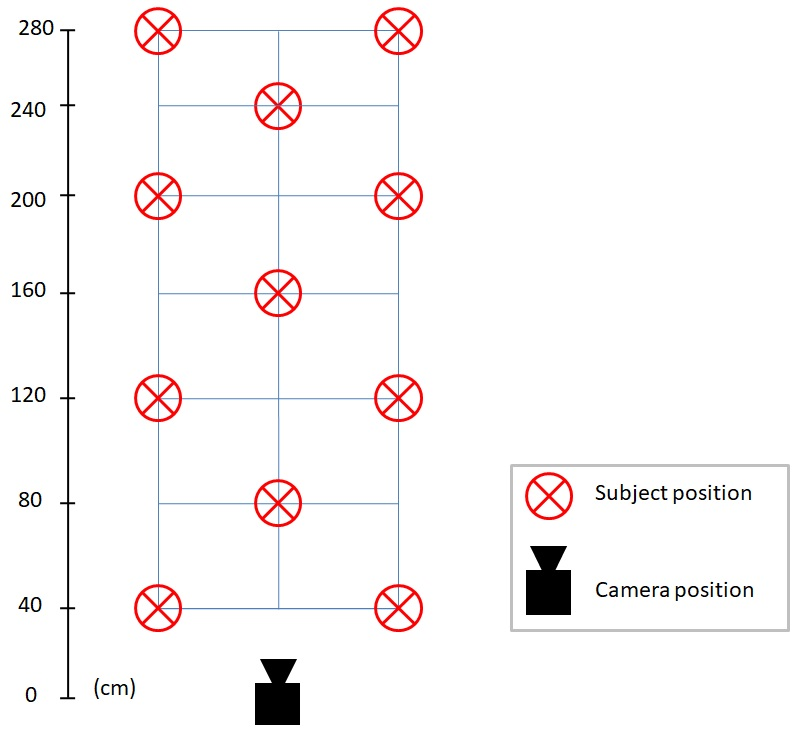

# Abstract

This project seeks to explore the field of depth estimation from monocular images.

It has been developed by Alvaro Rubio as part of the subject "Computer Vision and Multimedia Analysis" taught by Proff. Nicola Conci in the University of Trento, Italy.

# Description

To explore depth estimation from monocular images, a first research on te topic was made. From this first research it was conluded that the approach on the topic was twofold. 

On the one hand, we had the visual slam approach. Visual Simultaneous Localization And Mapping refers to the process of determining the position and orientation of a camera with respect to its surroundings, while simultaneously mapping the environment around that camera. Determining the position and orientation implies determining the depth of each point around the camera. There are many monocular SLAM systems (PTAM, MonoSLAM, SVO, DTAM, ORB-SLAM, etc) depending on the pixel density used and whether they are based on extracted features or pixel intesities.

On the other hand, we had deep learning approaches. In this field we can found many different approaches. However, we focused in two final options. Pydnet (https://github.com/mattpoggi/pydnet) and monodepth2 (https://github.com/nianticlabs/monodepth2). Both systems cast depth prediction as an image reconstruction problem, i.e, by using a database of stereo images these systems are trained to reconstruct a right image from a left image and viceversa. 
Althought our initial approach was to compare the accuracy of both neural networks, we decided to focus on the monodepth2. Nevertheless, the code developed does not requires any changes to be used with the output images from pydnet or any other depth-coded image.

Then, we create our own baseline of images. By the means of an stereo camera we took images of a single subject at different distances and wearing different outfits. The idea behind this was to check if there was a colour dependency on the depth estimation made by the neural network. The subject is located at 11 positions at 7 different distances as it is described in the image below. These images can be consulted at the download section under the name of "Baseline".

Afterwards, we crop our stereo images in two monocular images and run them through the monodepth2 network to obtain the depth estimation. Colour-coded images from the monodepth2 can be consulted at the download section under the name of "Monodepth2 output". 

We develop an algorithm to isolate the depth of the subject as well as calculate the regression model for each set of images. There are 12 set of images. Three different colours, two different camera positions and two different control points. Details can be consulted at "main.ipynb", were the code and thought process is explained step by step, as well as the conclussions and future work.

# Description of files
### YOLO
Yolo algorithm code.
Create folder inside called "weights" and add the weight file from the download section before running the algorithm.
source: https://github.com/Garima13a/YOLO-Object-Detection

### Monodepth2
Depth estimation algorithm from monocular images. Slightly modified from source to retrieve relative depth estimation (no scale applied)
source: https://github.com/nianticlabs/monodepth2

### preprocessing-code
Code for cropping the stereo images of the baseline in two monocular images. Preprocessed images can be find in "Left crop" in the download section.

### main.ipynb
Jupyter notebook. It includes the main code of this project. It is coded in an educational manner, i.e step by step, to facilitate the reuse or improvement of the code freely.

### contour-approach.ipynb
Jupyter notebook. It includes a different approach for solving our problem based on cropping the contour of the subject. It was discarded due to its unreliability.

# Download
[`YOLO weights`](https://mega.nz/#F!RUBB3YYJ!pbAz28PVzJnN4Vuq4KA5mg)

[`Baseline`](https://mega.nz/#F!9NQVkS7T!tasTrvKYt0w4h2sUOlsJJA) 

[`Left crop`](https://mega.nz/#F!tNBXRKKR!tDUTec3pCeqm5jBnJ5sDxg) 

[`monodepth2 output`](https://mega.nz/#F!kZQxRIKA!5pk7LA8qsHgg0moKPXFIgw) 

[`Results`](https://mega.nz/folder/kNg1GZLI#D6-u1qDQVVRm4M-GJeUofw) 

[`Test`](https://mega.nz/folder/gIxxBTbR#r0KMgDub4VAYt6su8TrX_g)

